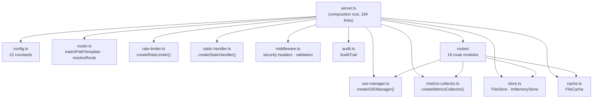

# myAgentic-IT-Project-team — Command Center

A local web application for managing the agentic system. Provides a unified
Command Center with tabs for **Command Center** (pipeline view + command
launcher), **Questionnaires** (answer questions, set statuses), **Decisions**
(create/answer/defer decisions), **Dashboard** (metrics & activity), and more —
so non-technical stakeholders can interact with the system without editing
markdown by hand.

## Prerequisites

- **Node.js ≥ 18**
- **npm** (install dependencies with `npm ci`)

## Quick Start

From the project root:

```bash
npm ci
npm start
```

Then open **http://127.0.0.1:3000** in your browser.

### Custom port

```bash
PORT=8080 npm start
```

## What It Does

| Feature                | Description                                                                                                                                        |
| ---------------------- | -------------------------------------------------------------------------------------------------------------------------------------------------- |
| **Command Center**     | Pipeline view showing phase/agent progress; command launcher for CREATE, AUDIT, REEVALUATE, etc.                                                   |
| **Questionnaires**     | Shows all questionnaires grouped by phase with answer-progress bars; per-question answer editing with auto-resize                                  |
| **Decisions**          | Create new decisions, answer or defer existing ones, view decision history                                                                         |
| **Dashboard**          | Metrics, activity feed, and system health overview                                                                                                 |
| **Status management**  | Dropdown per question: OPEN → ANSWERED → DEFERRED                                                                                                  |
| **Save**               | Per-question save, per-file save, or global Save All (Ctrl+S)                                                                                      |
| **Reevaluate**         | Saves all pending changes, writes `BusinessDocs/session/reevaluate-trigger.json`, and prompts you to type `REEVALUATE [SCOPE]` in the Copilot chat |
| **Export**             | Export all questionnaire data as JSON for external processing                                                                                      |
| **Help**               | Built-in help system with topic navigation (F1 or ? to toggle)                                                                                     |
| **Contract-compliant** | Reads/writes the exact markdown format defined in `templates/sdlc/contracts/questionnaire-output-contract.md`                                      |
| **Index rebuild**      | Automatically updates `BusinessDocs/questionnaire-index.md` after every save (debounced)                                                           |

## Architecture

### Module Dependency Diagram



### Request Lifecycle

```
Incoming HTTP Request
  │
  ├─ Locale check (/locales/*.json → serve directly)
  │
  ├─ Rate Limiter (rate-limiter.ts)
  │   └─ 429 Too Many Requests if limit exceeded
  │
  ├─ Auth Guard (API_KEY env check)
  │   └─ 401 Unauthorized if key mismatch
  │
  ├─ Route Resolution (router.ts)
  │   ├─ resolveRoute(ROUTES, method, pathname)
  │   │   ├─ Match found → execute route handler
  │   │   ├─ Path exists but wrong method → 405 Method Not Allowed
  │   │   └─ No match → static file handler (static-handler.ts)
  │   └─ findRouteTemplate() for metrics key
  │
  └─ Record Metric (metrics-collector.ts)
      └─ method + endpoint + duration + status code
```

### SSE Lifecycle

```
Client connects to GET /api/events
  │
  ├─ Route handler (routes/misc.ts) sets SSE headers
  │   └─ Content-Type: text/event-stream
  │
  ├─ sseManager.addClient(req, res)
  │   ├─ Adds to internal Set
  │   ├─ Starts heartbeat (30s interval)
  │   └─ Registers disconnect handler (req 'close')
  │
  ├─ Server mutations trigger sseManager.broadcast(event, data)
  │   └─ Writes "event: <name>\ndata: <json>\n\n" to all clients
  │
  └─ Client disconnects
      ├─ Heartbeat timer cleared
      └─ Client removed from Set
```

### Metrics Collection Flow

```
Request completes
  │
  ├─ recordMetric(method, endpoint, durationMs, statusCode)
  │   └─ metricsCollector.record()
  │       ├─ Increments requestCount
  │       ├─ Tracks per-endpoint count + response times
  │       └─ Increments errorCount if status >= 400
  │
  ├─ Auto-flush timer (every 60s)
  │   └─ metricsCollector.flush()
  │       └─ Writes to BusinessDocs/metrics/runtime-metrics.json
  │
  └─ POST /api/metrics/flush (manual trigger)
      └─ metricsCollector.flush()
```

### Source Layout

```
src/webapp/
  server.ts               Composition root — wires all modules, creates HTTP server
  config.ts               All configuration constants (PORT, HOST, paths, intervals, limits)
  router.ts               Lightweight path-template router (matchPathTemplate, resolveRoute)
  rate-limiter.ts          In-memory rate limiter with automatic pruning
  sse-manager.ts           SSE connection manager (heartbeat, broadcast, cleanup)
  metrics-collector.ts     Per-endpoint metrics with periodic disk flushing
  static-handler.ts        Static file serving (MIME types, CSP, SPA fallback)
  mcp-server.ts           MCP tool server (IDE integration)
  store.ts                Storage abstraction (FileStore + InMemoryStore)
  models.ts               Domain parsing (questionnaires, decisions, session state)
  schemas.ts              JSON schema validation (Ajv)
  middleware.ts            Security headers, input validation, logging
  cache.ts                File cache with mtime invalidation
  audit.ts                Mutation audit trail (append-only JSONL)
  strings.ts              Externalized UI strings
  file-lock.ts            Async per-file mutex
  drift-detector.ts       Configuration drift detection
  session-state-resolver.ts  Session file resolution
  session-tracker.ts      Session lifecycle tracking
  lesson-promotion.ts     Lesson-to-decision promotion
  utils/
    errors.ts             Structured error catalog
    secret-utils.ts       Secret pattern detection
  routes/                 16 route modules (one per API domain)
  ui/                     React SPA (Vite + React + TypeScript + Tailwind CSS)
```

- **Server** binds to `127.0.0.1` only (localhost) for security
- **Markdown is the source of truth** — the UI reads and writes the same files
  the agentic system uses
- **No database** — all state lives in your `BusinessDocs/` folder as JSON and
  Markdown files
- **Runtime dependencies:** `@modelcontextprotocol/sdk`, `ajv`, `ajv-formats`,
  `tsx`

## API Endpoints (selected)

| Method | Path                     | Description                                                                                                    |
| ------ | ------------------------ | -------------------------------------------------------------------------------------------------------------- |
| GET    | `/api/questionnaires`    | List all questionnaires with parsed questions                                                                  |
| GET    | `/api/session`           | Current session state (if exists)                                                                              |
| POST   | `/api/save`              | Save answer(s) for a questionnaire file (max 200 updates per request)                                          |
| POST   | `/api/reevaluate`        | Write reevaluation trigger file                                                                                |
| GET    | `/api/decisions`         | Parse and return all decisions from `decisions.md`                                                             |
| POST   | `/api/decisions`         | Create, answer, defer, or delete a decision (`action`: `create` / `answer` / `defer` / `delete`)               |
| POST   | `/api/command`           | Queue an agentic command (e.g. `CREATE`, `REEVALUATE`) and get clipboard text to paste in Copilot Chat         |
| GET    | `/api/command`           | Retrieve the currently queued command (or `null`)                                                              |
| GET    | `/api/progress`          | Live phase/agent progress derived from `session-state.json`                                                    |
| GET    | `/api/export`            | Export all questionnaire data as JSON                                                                          |
| GET    | `/api/help?topic=<slug>` | Without `topic`: returns help table-of-contents. With `topic`: returns the markdown content for that help file |
| GET    | `/api/health`            | Readiness probe (uptime, version, SSE connections, timestamp) — used by Docker HEALTHCHECK                     |
| GET    | `/api/dashboard/*`       | Dashboard aggregation endpoints (stats, activity, burndown)                                                    |
| GET    | `/api/metrics-dashboard` | Runtime metrics and per-endpoint timing data                                                                   |
| GET    | `/health`                | Liveness probe (status, version, uptime, store status)                                                         |
| GET    | `/events`                | SSE stream for real-time UI updates                                                                            |

## Reevaluation Flow

1. Answer questions in the UI
2. Click **Save** (or Ctrl+S)
3. Click **Reevaluate** → choose scope → confirm
4. The server writes `BusinessDocs/session/reevaluate-trigger.json`
5. In the Copilot chat, type `REEVALUATE ALL` (or the scope you selected)
6. The agentic system picks up the updated answers and re-processes

## Security Notes

- Server only listens on `127.0.0.1` — not accessible from the network
- Security headers on every response: `X-Content-Type-Options: nosniff`,
  `X-Frame-Options: DENY`, `Referrer-Policy: strict-origin-when-cross-origin`,
  and `Content-Security-Policy`
- All file writes use `safeWriteSync` with try-catch (returns 500 with a
  user-friendly message on I/O failure)
- Concurrent file writes protected by async file locking (per-file mutex)
- Path traversal protection on all file operations
- Request body limited to 1 MB
- Strict JSON content-type validation on POST endpoints
- Input string validation with `assertString()` (type + max-length enforcement)
- Batch save capped at 200 updates per request
- Question IDs validated against `Q-\d{2}-\d{3}` format
- Status values validated against allowed set (`OPEN`, `ANSWERED`, `DEFERRED`)
- Command validation uses strict allowlist matching
- PORT validated to 1–65535 range at startup
- Directory traversal depth limited to 20 levels
- SSE command queue capped at 50 entries
- Questionnaire index rebuild debounced (500ms) to prevent redundant I/O
- 405 responses include computed `Allow` header and security headers
- Server error handling with specific `EADDRINUSE` detection
